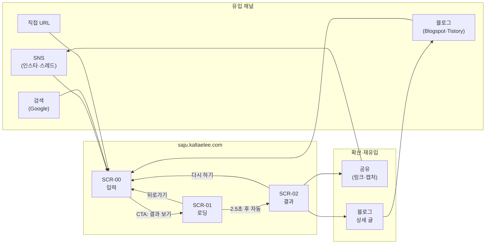
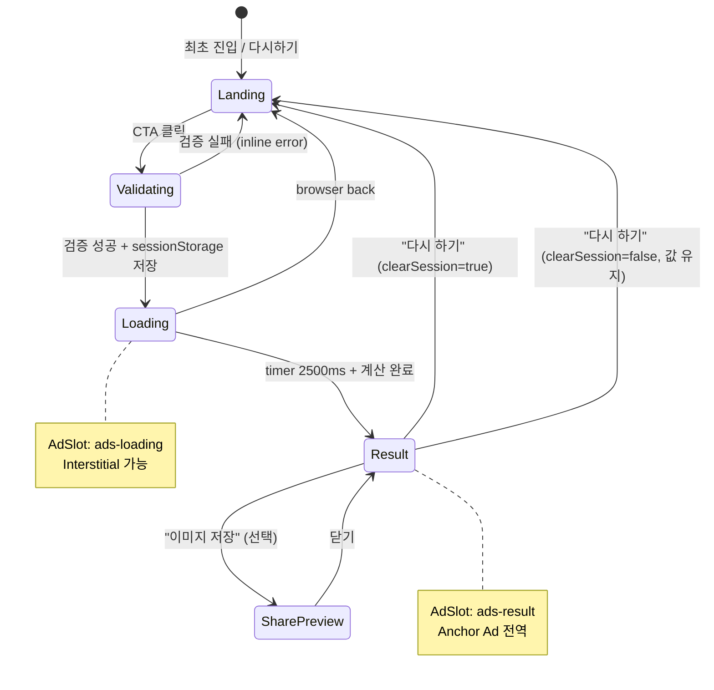
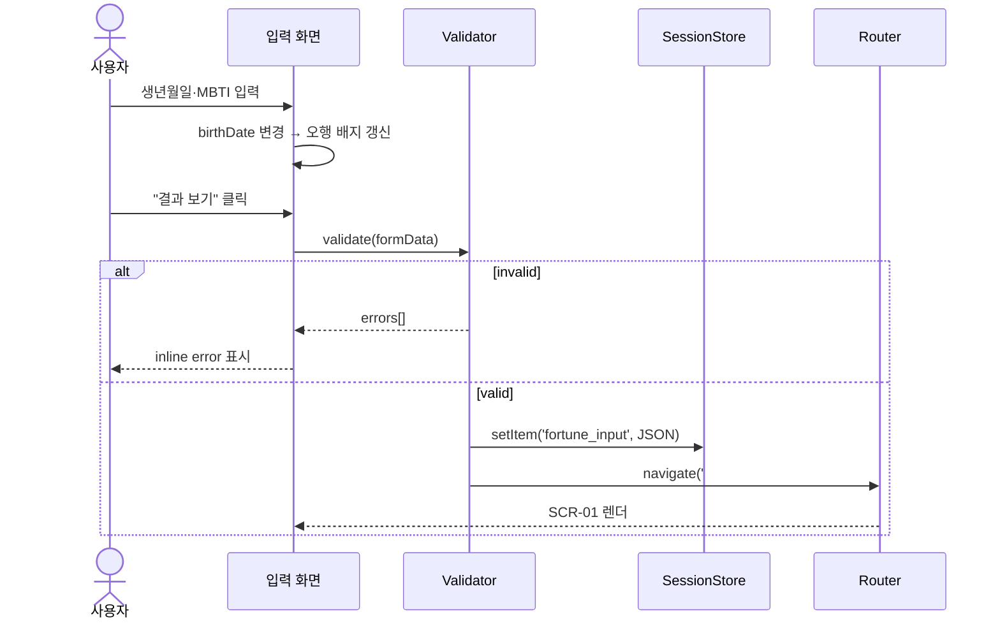
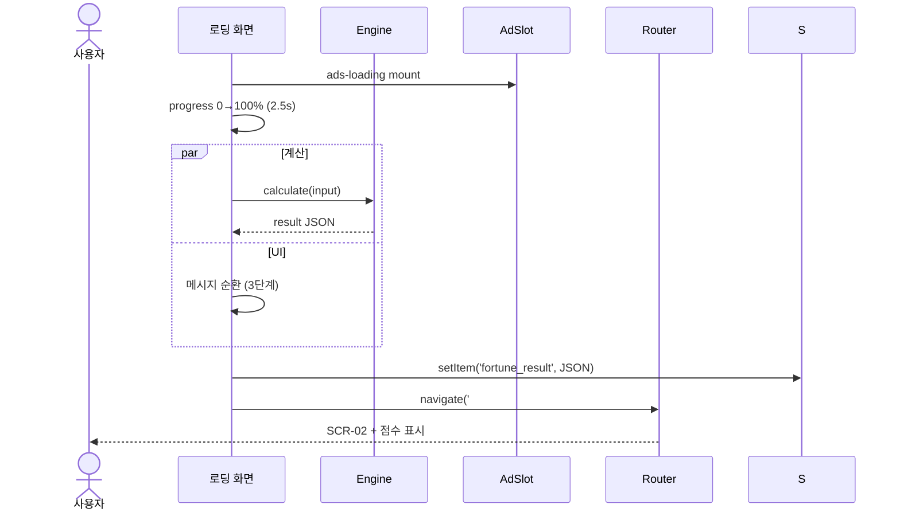
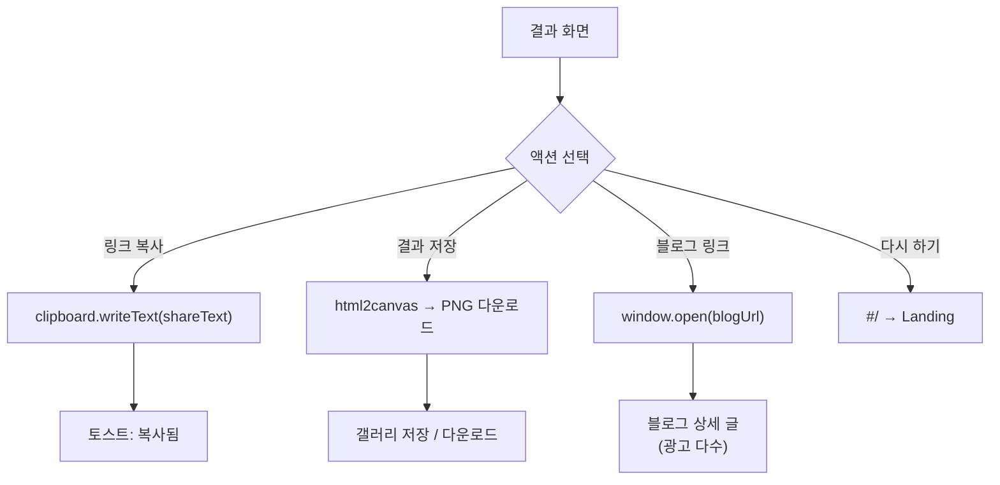
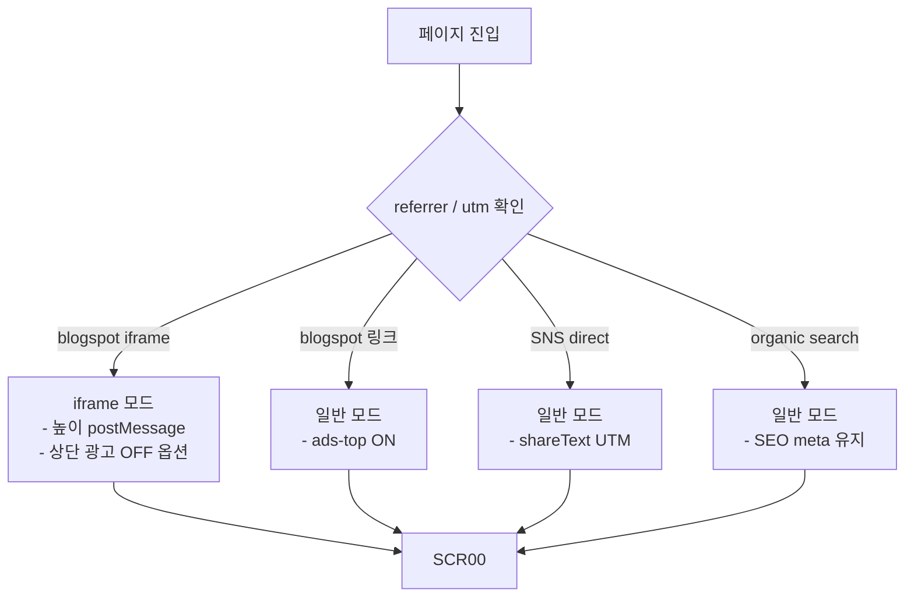
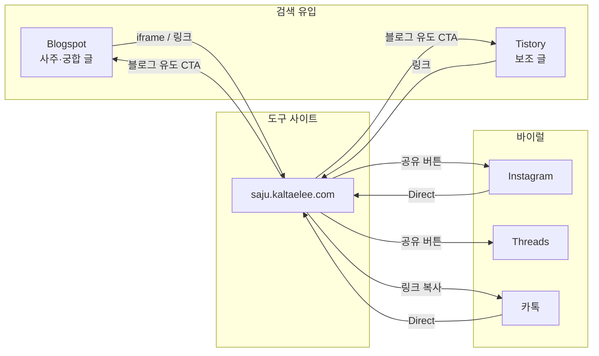

# 화면흐름도 — MBTI × 오행 궁합 테스트

| 항목 | 내용 |
|------|------|
| 버전 | v0.1 |
| 작성일 | 2026-07-05 |

---

## 1. 전체 사용자 여정 (User Journey)

---

## 2. 화면 전환 상태도 (State Machine)

---

## 3. 화면별 이벤트 흐름

### 3.1 SCR-00 → SCR-01

### 3.2 SCR-01 → SCR-02

### 3.3 SCR-02 공유·블로그 유도

---

## 4. 유입 경로별 분기

---

## 5. 에러·예외 흐름

| 상황 | 처리 | 화면 |
|------|------|------|
| 생년월일 미래 날짜 | inline error | SCR-00 |
| MBTI 미선택 | 필드 highlight | SCR-00 |
| sessionStorage 없이 `#/result` 직접 접근 | `#/` redirect | SCR-00 |
| sessionStorage 없이 `#/loading` 직접 접근 | `#/` redirect | SCR-00 |
| AdSense 로드 실패 | 슬롯 collapse (min-height 0) | 전체 |
| JS 비활성 | `<noscript>` 안내 | SCR-00 |

---

## 6. 트래픽 무한 루프 (모듈 D 연계)

---

## 7. 화면 ID ↔ Hash 라우팅 매핑

| Hash | 화면 ID | 진입 조건 |
|------|---------|----------|
| `#/` 또는 `` | SCR-00 | 기본 |
| `#/loading` | SCR-01 | 유효한 입력 + sessionStorage |
| `#/result` | SCR-02 | 계산 결과 sessionStorage |
| `#/result?share=1` | SCR-03 | 결과 + 캡처 모드 |
