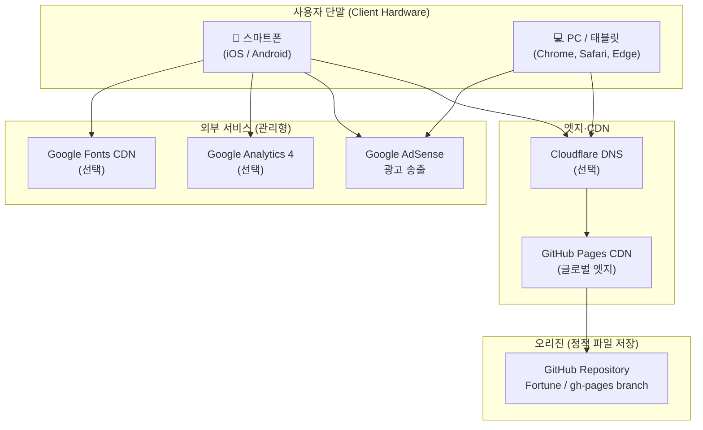

# 하드웨어 구성도 — MBTI × 오행 궁합 테스트

| 항목 | 내용 |
|------|------|
| 버전 | v0.1 |
| 작성일 | 2026-07-05 |
| 아키텍처 유형 | **서버리스 정적 웹** (Serverless Static Web) |

---

## 1. 개요

본 서비스는 **자체 서버·DB를 운영하지 않는** 클라이언트 중심 아키텍처입니다.  
"하드웨어"는 실질적으로 **클라우드 CDN + GitHub Pages + 사용자 단말**로 구성됩니다.

---

## 2. 물리·논리 구성도

---

## 3. 구성 요소 상세

### 3.1 사용자 단말 (Client)

| 구분 | 최소 사양 | 권장 | 역할 |
|------|----------|------|------|
| CPU | 1GHz+ | — | JS 계산·DOM 렌더 |
| RAM | 2GB+ | 4GB+ | 브라우저 탭 |
| 저장소 | — | — | sessionStorage (~5KB) |
| 네트워크 | 3G | 4G/Wi-Fi | HTML·JS 최초 로드 |
| 화면 | 320px width | 390px+ | 모바일 UI |

**운영체제·브라우저 지원**

| OS | 브라우저 | 최소 버전 |
|----|----------|----------|
| iOS | Safari | 14+ |
| Android | Chrome | 90+ |
| Desktop | Chrome, Edge, Firefox | 최신 2버전 |

### 3.2 GitHub Pages (오리진 호스팅)

| 항목 | 값 |
|------|-----|
| 저장소 | `kaltaelee/Fortune` (예시) |
| 브랜치 | `gh-pages` 또는 `/docs` |
| 용량 | HTML+JS+JSON < 1MB |
| SLA | GitHub 제공 (99.9% 목표) |
| 비용 | **무료** (퍼블릭 repo) |

### 3.3 DNS·도메인 (kaltaelee.com)

| 레코드 | 타입 | 값 | 용도 |
|--------|------|-----|------|
| `saju` | CNAME | `kaltaelee.github.io` | 도구 서브도메인 |
| `@` | A/ALIAS | (기존 유지) | 루트 도메인 |

### 3.4 Google AdSense (광고 인프라)

| 항목 | 내용 |
|------|------|
| 승인 도메인 | `kaltaelee.com` (루트 승인 → 서브도메인 추가) |
| 송출 | Google 광고 서버 (클라이언트 JS SDK) |
| 자체 HW | 없음 (Google 관리형) |

---

## 4. 서버리스 특성 — **미사용** 리소스

| 전통 구성 | 본 프로젝트 |
|----------|------------|
| 웹 서버 (EC2, VPS) | ❌ 없음 |
| 데이터베이스 (MySQL 등) | ❌ 없음 |
| 백엔드 API | ❌ 없음 |
| 파일 스토리지 (S3) | ❌ (GitHub만) |
| SSL 인증서 | ✅ GitHub/Let's Encrypt 자동 |

→ **운영·유지보수 HW 비용 = 0원**

---

## 5. 용량·트래픽 추정

| 항목 | 추정값 | 비고 |
|------|--------|------|
| 페이지 weight | ~80KB (gzip) | 단일 HTML + inline |
| 월 PV 10만 | ~8GB 전송 | GitHub Pages 무료 한도 내 |
| 동시 접속 | CDN 분산 | 병목 없음 |
| sessionStorage | ~2KB/세션 | 클라이언트 only |

---

## 6. 장애·대체 시나리오

| 장애 | 영향 | 대응 |
|------|------|------|
| GitHub Pages down | 도구 접속 불가 | Netlify mirror (백업) |
| AdSense down | 광고 미노출, 도구 정상 | AdSlot collapse |
| DNS failure | 전체 unreachable | DNS TTL 300s, 모니터링 |
| Google Fonts down | 폰트 fallback | system-ui stack |

---

## 7. 보안 (HW 관점)

- **서버 공격면 없음** — 정적 파일만 제공
- **DDoS** — GitHub/CDN 흡수
- **개인정보** — 생년월일 서버 미저장 (클라이언트 메모리 only)
