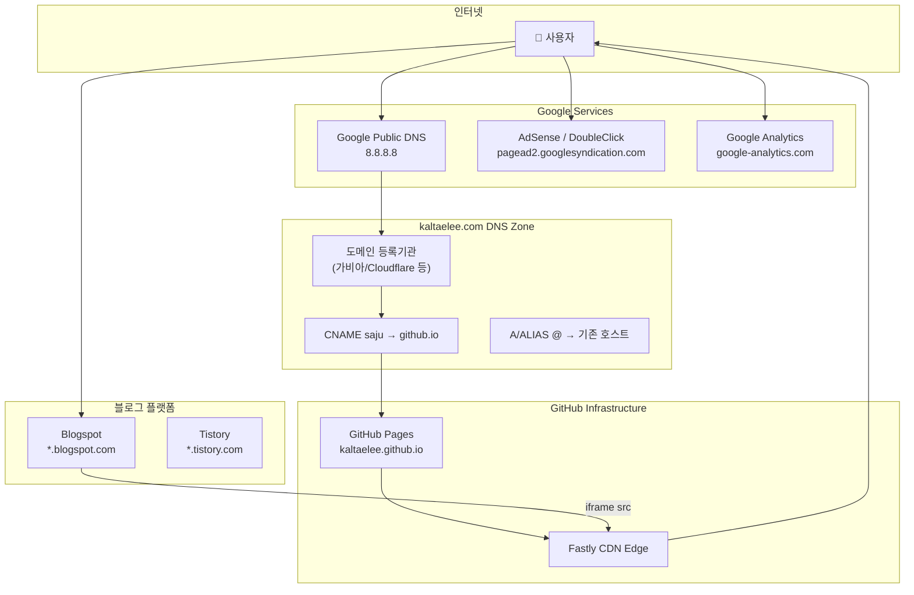
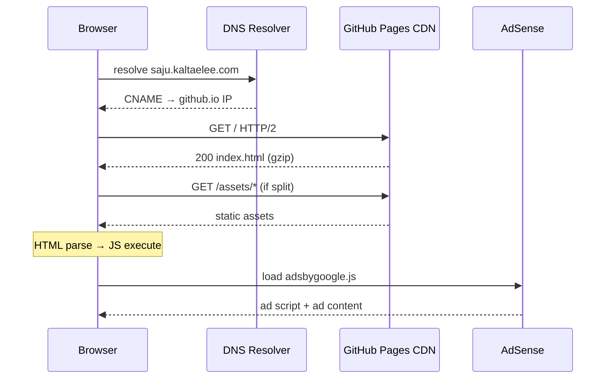
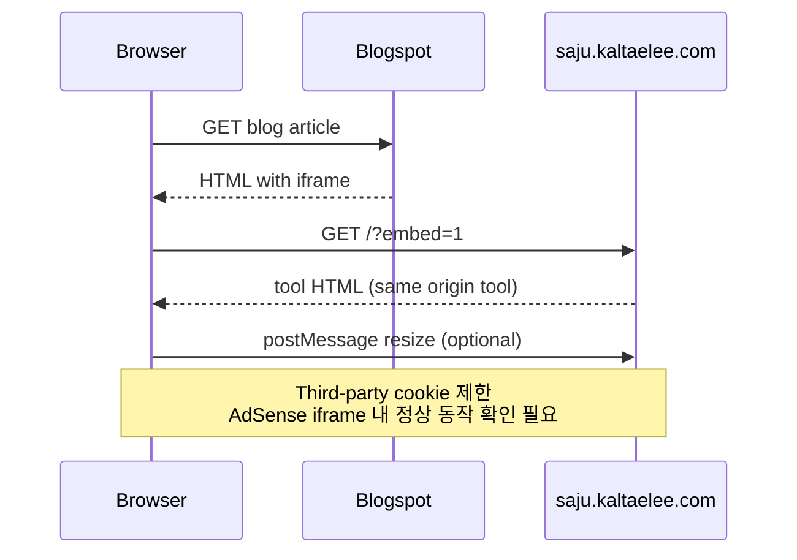
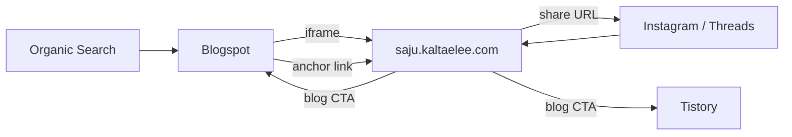
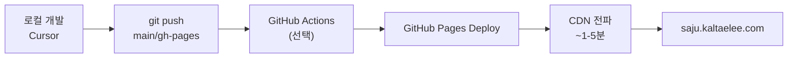

# 네트워크 구성도 — MBTI × 오행 궁합 테스트

| 항목 | 내용 |
|------|------|
| 버전 | v0.1 |
| 작성일 | 2026-07-05 |
| 주 도메인 | `kaltaelee.com` |
| 서비스 FQDN | `saju.kaltaelee.com` |

---

## 1. 전체 네트워크 토폴로지



---

## 2. DNS 설정 명세

### 2.1 프로덕션 레코드

| 호스트 | 타입 | 값 | TTL |
|--------|------|-----|-----|
| `saju.kaltaelee.com` | CNAME | `kaltaelee.github.io` | 3600 |
| `_saju.kaltaelee.com` | TXT | (GitHub Pages verification) | 3600 |

### 2.2 GitHub Pages Custom Domain

```
Repository → Settings → Pages
  Custom domain: saju.kaltaelee.com
  Enforce HTTPS: ✅
```

### 2.3 SSL/TLS

| 구간 | 프로토콜 | 인증서 |
|------|----------|--------|
| User ↔ CDN | HTTPS TLS 1.2+ | Let's Encrypt (GitHub 자동) |
| CDN ↔ Origin | GitHub 내부 | — |

---

## 3. HTTP 요청 흐름

### 3.1 최초 페이지 로드



### 3.2 iframe 임베드 (Blogspot)



---

## 4. 외부 연동 엔드포인트

| 서비스 | URL / Domain | 방향 | 용도 |
|--------|-------------|------|------|
| GitHub Pages | `saju.kaltaelee.com` | Inbound | 정적 호스팅 |
| AdSense | `pagead2.googlesyndication.com` | Outbound | 광고 |
| Google Fonts | `fonts.googleapis.com` | Outbound | 웹폰트 (선택) |
| Blogspot | `*.blogspot.com` | Bidirectional | iframe·링크 |
| Tistory | `*.tistory.com` | Outbound link | 보조 SEO |
| Web Share API | — | Local | OS 네이티브 공유 |

**API 호출 없음** — 모든 계산 클라이언트 로컬

---

## 5. CORS·보안 헤더

### 5.1 GitHub Pages 기본

| 헤더 | 값 | 비고 |
|------|-----|------|
| `X-Frame-Options` | — | iframe 허용 필요 |
| CSP | v2 수동 meta tag | AdSense domain allowlist |

### 5.2 Content-Security-Policy (권장)

```http
Content-Security-Policy:
  default-src 'self';
  script-src 'self' 'unsafe-inline' https://pagead2.googlesyndication.com https://www.googletagmanager.com;
  frame-src https://googleads.g.doubleclick.net https://tpc.googlesyndication.com;
  img-src 'self' data: https:;
  style-src 'self' 'unsafe-inline' https://fonts.googleapis.com;
  font-src https://fonts.gstatic.com;
  connect-src 'self' https://www.google-analytics.com;
```

### 5.3 iframe 임베드 정책

- `X-Frame-Options: DENY` **설정하지 않음** (Blogspot embed 허용)
- 악성 embed 방지: v2에서 `Referrer-Policy` + known referrer whitelist 검토

---

## 6. 트래픽 경로 (모듈 D)



### UTM 파라미터 규칙

| 유입 | URL 예시 |
|------|----------|
| Blogspot iframe | `?embed=1&utm_source=blogspot&utm_medium=iframe` |
| Blogspot 링크 | `?utm_source=blogspot&utm_medium=link` |
| SNS 공유 | `?utm_source=share&utm_medium=social` |
| Organic | (none) |

---

## 7. 방화벽·포트

| 항목 | 값 |
|------|-----|
| Inbound Port | 443 (HTTPS only) |
| Outbound | 443 to Google, GitHub |
| SSH/RDP | **없음** (서버리스) |

---

## 8. 네트워크 모니터링 (선택)

| 도구 | 목적 |
|------|------|
| Google Search Console | `saju.kaltaelee.com` property |
| AdSense 대시보드 | RPM, 페이지뷰 |
| UptimeRobot (free) | 5분 ping `saju.kaltaelee.com` |
| GA4 | 유입 경로·이탈률 |

---

## 9. 배포·CI/CD 네트워크 흐름



| 단계 | 네트워크 |
|------|----------|
| git push | SSH/HTTPS → github.com:443 |
| Pages build | GitHub 내부 |
| CDN invalidation | 자동 (push 시) |
