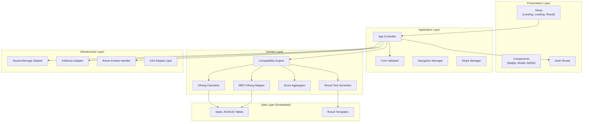
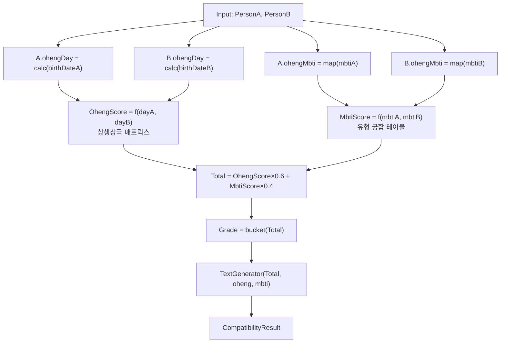
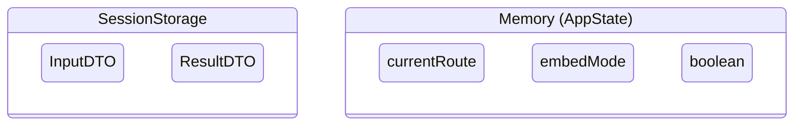
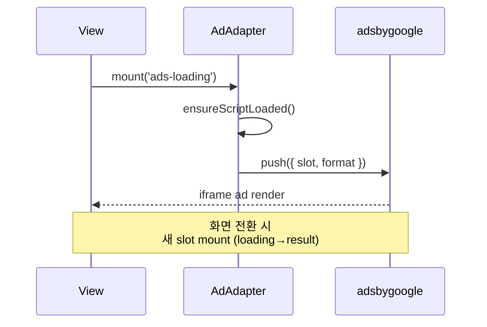

# 소프트웨어 아키텍처 — MBTI × 오행 궁합 테스트

| 항목 | 내용 |
|------|------|
| 버전 | v0.1 |
| 작성일 | 2026-07-05 |
| 패턴 | SPA-lite (Hash Router, No Framework) |
| 배포 | GitHub Pages + Custom Domain |

---

## 1. 아키텍처 개요



---

## 2. 파일·디렉터리 구조

```
Fortune/
├── index.html                 # 진입점, AdSense script, app mount
├── docs/                      # 설계 문서 (본 문서)
├── src/
│   ├── app.js                 # App bootstrap, router init
│   ├── router.js              # Hash-based SPA router
│   ├── views/
│   │   ├── landing.js         # SCR-00
│   │   ├── loading.js         # SCR-01
│   │   └── result.js          # SCR-02
│   ├── components/
│   │   ├── oheng-badge.js
│   │   ├── mbti-modal.js
│   │   ├── ad-slot.js
│   │   └── progress-bar.js
│   ├── domain/
│   │   ├── oheng-calc.js      # 생년월일 → 일간 오행
│   │   ├── mbti-oheng.js      # MBTI → 대표 오행
│   │   ├── compatibility.js   # 궁합 점수 엔진
│   │   └── text-generator.js  # 결과 문구 생성
│   ├── data/
│   │   ├── ganji-table.js     # 60갑자 / 일간 lookup
│   │   ├── mbti-types.js      # 16 MBTI 메타
│   │   ├── oheng-relations.js # 상생상극 매트릭스
│   │   └── result-templates.js
│   └── infra/
│       ├── storage.js         # sessionStorage wrapper
│       ├── adsense.js         # AdSlot lifecycle
│       └── embed.js           # iframe resize, embed mode
├── assets/
│   ├── style.css
│   └── icons/
└── CNAME                      # saju.kaltaelee.com
```

**v0.1 프로토타입:** `index.html` 단일 파일 (inline CSS/JS) → 이후 위 구조로 분리

---

## 3. 레이어별 책임

### 3.1 Presentation Layer

| 모듈 | 책임 |
|------|------|
| `views/*` | DOM 렌더링, 이벤트 바인딩, 화면별 lifecycle |
| `components/*` | 재사용 UI (배지, 모달, 광고 슬롯) |
| `router.js` | `#/` `#/loading` `#/result` 해시 라우팅 |

### 3.2 Application Layer

| 모듈 | 책임 |
|------|------|
| `app.js` | 초기화, 전역 상태, 화면 전환 orchestration |
| `FormValidator` | birthDate 범위, MBTI 필수, inline error |
| `ShareManager` | clipboard, html2canvas, shareText 생성 |

### 3.3 Domain Layer (핵심 비즈니스)

| 모듈 | 입력 | 출력 |
|------|------|------|
| `OhengCalculator` | `YYYY-MM-DD` | `{ oheng: 'fire', hanja: '火' }` |
| `MbtiOhengMapper` | `'INTJ'` | `{ oheng: 'metal', ... }` |
| `CompatibilityEngine` | PersonA, PersonB | `CompatibilityResult` |
| `ScoreAggregator` | 오행점수, MBTI점수 | `0~100` |
| `TextGenerator` | CompatibilityResult | `{ summary, detail, shareText }` |

### 3.4 Data Layer

**모든 데이터 파일 내장 — 외부 API Zero**

| 파일 | 내용 | 크기(추정) |
|------|------|-----------|
| `ganji-table.js` | 1900~2030 일간 lookup | ~30KB |
| `oheng-relations.js` | 5×5 상생상극 점수 | ~1KB |
| `mbti-types.js` | 16유형 + 오행 매핑 | ~2KB |
| `result-templates.js` | 문구 템플릿 | ~10KB |

### 3.5 Infrastructure Layer

| 모듈 | 책임 |
|------|------|
| `storage.js` | `fortune_input`, `fortune_result` key 관리 |
| `adsense.js` | `(adsbygoogle).push()`, lazy load, slot refresh |
| `embed.js` | `?embed=1` 감지, `postMessage` height |

---

## 4. 궁합 계산 알고리즘 (Domain Logic)



### 4.1 오행 점수 (OhengScore)

- 두 사람 **일간 오행** + **MBTI 오행** 4개 벡터
- `oheng-relations.js` 상생(+20), 상극(-15), 비견(+10) 등
- 정규화 → 0~100

### 4.2 MBTI 점수 (MbtiScore)

- 16×16 **고정 궁합 매트릭스** (에버그린, 내장)
- 예: INTJ×ENFP = 85, INTJ×ESTJ = 60

---

## 5. 상태 관리



| Key | Schema | TTL |
|-----|--------|-----|
| `fortune_input` | `InputDTO` | tab close |
| `fortune_result` | `ResultDTO` | tab close |

**서버 세션 없음 · 쿠키 없음 (AdSense 제외)**

---

## 6. AdSense 소프트웨어 통합



| Slot | mount 시점 | unmount |
|------|-----------|---------|
| ads-top | Landing onLoad | — |
| ads-loading | Loading onLoad | Result 전환 시 |
| ads-result | Result onLoad | — |
| Anchor | AdSense auto | — |

---

## 7. 라우터 설계

```javascript
// router.js (개념)
const routes = {
  '/':           { view: LandingView,  guard: null },
  '/loading':    { view: LoadingView,  guard: requireInput },
  '/result':     { view: ResultView,   guard: requireResult },
};
```

| Guard | 조건 | fail → |
|-------|------|--------|
| `requireInput` | `fortune_input` exists | `#/` |
| `requireResult` | `fortune_result` exists | `#/loading` or `#/` |

---

## 8. 에버그린 준수 체크 (모듈 A)

| 요건 | 구현 |
|------|------|
| 데이터 자급 | ganji·MBTI·템플릿 전부 JS 내장 |
| 무갱신 유지 | API·날짜 의존 로직 없음 |
| 외부 의존 최소 | AdSense·Fonts만 (도구 동작은 offline 가능) |
| 오프라인 | Service Worker v2 (선택) |

---

## 9. 빌드·배포 파이프라인

| 단계 | 도구 | 산출물 |
|------|------|--------|
| 개발 | Cursor / VS Code | src |
| (선택) minify | esbuild / terser | dist |
| 배포 | git push → gh-pages | live site |
| DNS | CNAME | saju.kaltaelee.com |

**CI/CD (선택 GitHub Actions):**

```yaml
# .github/workflows/deploy.yml (개념)
on: push to main
jobs: deploy → peaceiris/actions-gh-pages
```

---

## 10. 확장 로드맵

| Phase | 기능 | 아키텍처 변경 |
|-------|------|-------------|
| v0.1 | MBTI×오행 테스트 | 단일 HTML |
| v0.2 | 파일 분리 + embed mode | src/ 구조 |
| v1.0 | AdSense + GA4 + Blogspot loop | AdAdapter, UTM |
| v1.1 | 오행 밸런스 계산기 (아이디어 B) | 공유 Engine |
| v2.0 | Service Worker offline | infra/sw.js |

---

## 11. 기술 스택 요약

| 구분 | 선택 | 이유 |
|------|------|------|
| Markup | HTML5 | Blogspot iframe 호환 |
| Style | CSS3 (custom properties) | 무의존 |
| Logic | Vanilla ES2020+ | 번들·빌드 불필요 |
| Router | Hash-based | GitHub Pages SPA |
| Storage | sessionStorage | Privacy, no server |
| Hosting | GitHub Pages | 무료, CNAME |
| Ads | Google AdSense | 기존 kaltaelee.com 승인 |
| Framework | **None** | 에버그린·경량 |
