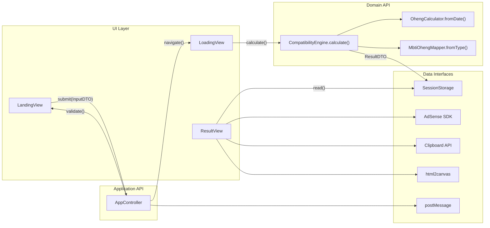
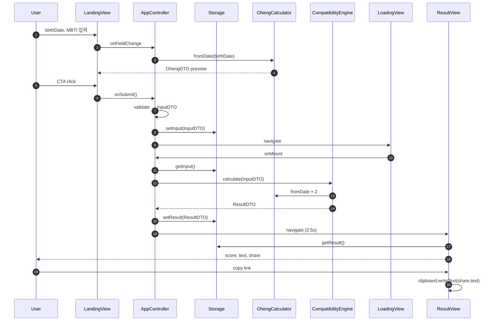

# 인터페이스 설계서 — 화면·시스템 간 데이터 연동 정의

| 항목 | 내용 |
|------|------|
| 버전 | v0.1 |
| 작성일 | 2026-07-05 |
| 범위 | UI ↔ Application ↔ Domain ↔ Storage ↔ External |

---

## 1. 인터페이스 계층 개요



---

## 2. 데이터 타입 정의 (DTO)

### 2.1 InputDTO

사용자 입력 → `sessionStorage.fortune_input`

```typescript
interface PersonInput {
  birthDate: string;      // ISO "YYYY-MM-DD", required
  mbti: MbtiType;         // "INTJ" | ... | "ESFP", required
}

interface InputDTO {
  personA: PersonInput;
  personB: PersonInput;
  meta?: {
    embed: boolean;       // ?embed=1
    utmSource?: string;
    utmMedium?: string;
    createdAt: string;    // ISO datetime
  };
}
```

### 2.2 OhengDTO

```typescript
type OhengType = 'wood' | 'fire' | 'earth' | 'metal' | 'water';

interface OhengDTO {
  type: OhengType;
  labelKo: string;        // "목", "화", ...
  hanja: string;          // "木", "火", ...
  color: string;          // "#4CAF50"
  icon: string;           // "🌳"
}
```

### 2.3 PersonAnalysisDTO

```typescript
interface PersonAnalysisDTO {
  input: PersonInput;
  ohengDay: OhengDTO;     // 생년월일 기준 일간 오행
  ohengMbti: OhengDTO;    // MBTI 매핑 오행
  dayMaster: string;      // 일간 한자 e.g. "甲"
}
```

### 2.4 CompatibilityResultDTO (ResultDTO)

`sessionStorage.fortune_result`

```typescript
interface CompatibilityResultDTO {
  score: number;              // 0~100 integer
  grade: {
    code: 'S' | 'A' | 'B' | 'C' | 'D';
    label: string;            // "찰떡 궁합"
    emoji: string;            // "🔥"
  };
  personA: PersonAnalysisDTO;
  personB: PersonAnalysisDTO;
  ohengAnalysis: {
    score: number;
    summary: string;          // "금(金)이 화(火)를 단련"
    relation: string;         // "상생" | "상극" | "비견"
    balanceBars?: Record<OhengType, number>;  // optional UI
  };
  mbtiAnalysis: {
    score: number;
    summary: string;
    detail: string;           // 2~3문단
  };
  share: {
    text: string;             // SNS 복사용
    url: string;              // canonical + UTM
    title: string;
  };
  blogLinks: BlogLinkDTO[];
  calculatedAt: string;       // ISO datetime
}
```

### 2.5 BlogLinkDTO

```typescript
interface BlogLinkDTO {
  label: string;            // "금(金)×화(火) 궁합 해설"
  url: string;              // blogspot URL
  tags: string[];           // ["금", "화", "INTJ"]
}
```

### 2.6 MbtiType

```typescript
type MbtiType =
  | 'INTJ' | 'INTP' | 'ENTJ' | 'ENTP'
  | 'INFJ' | 'INFP' | 'ENFJ' | 'ENFP'
  | 'ISTJ' | 'ISFJ' | 'ESTJ' | 'ESFJ'
  | 'ISTP' | 'ISFP' | 'ESTP' | 'ESFP';
```

---

## 3. 화면 ↔ Application 인터페이스

### 3.1 LandingView → AppController

| IF-ID | 방향 | 메서드 / 이벤트 | Payload | Response |
|-------|------|----------------|---------|----------|
| IF-L01 | UI→App | `onFieldChange(person, field, value)` | `{ person: 'A'\|'B', field, value }` | `{ ohengPreview?: OhengDTO }` |
| IF-L02 | UI→App | `onMbtiSelect(person, mbti)` | `{ person, mbti: MbtiType }` | `{ ohengMbti: OhengDTO }` |
| IF-L03 | UI→App | `onSubmit()` | — | `{ ok: boolean, errors?: ValidationError[] }` |
| IF-L04 | App→UI | `renderErrors(errors)` | `ValidationError[]` | DOM update |
| IF-L05 | App→UI | `navigateToLoading()` | — | route change |

#### ValidationError

```typescript
interface ValidationError {
  field: string;    // "personA.birthDate"
  code: 'REQUIRED' | 'INVALID_DATE' | 'FUTURE_DATE' | 'OUT_OF_RANGE';
  message: string;  // "생년월일을 입력해 주세요"
}
```

### 3.2 LoadingView → AppController

| IF-ID | 방향 | 메서드 / 이벤트 | Payload | Response |
|-------|------|----------------|---------|----------|
| IF-D01 | UI→App | `onMount()` | — | triggers calculation |
| IF-D02 | App→Domain | `calculate(input: InputDTO)` | InputDTO | ResultDTO |
| IF-D03 | App→UI | `onProgress(percent)` | `0~100` | progress bar |
| IF-D04 | App→UI | `onMessage(text)` | string | status text |
| IF-D05 | App→UI | `navigateToResult()` | ResultDTO | route change |
| IF-D06 | App→Ads | `mountAdSlot('ads-loading')` | slotId | — |

### 3.3 ResultView → AppController

| IF-ID | 방향 | 메서드 / 이벤트 | Payload | Response |
|-------|------|----------------|---------|----------|
| IF-R01 | UI→App | `onMount()` | — | read ResultDTO |
| IF-R02 | App→UI | `renderResult(dto)` | ResultDTO | full render |
| IF-R03 | UI→App | `onCopyLink()` | — | `{ success: boolean }` |
| IF-R04 | UI→App | `onSaveImage()` | — | `{ blob: Blob }` |
| IF-R05 | UI→App | `onRetry(clearForm)` | boolean | navigate `#/` |
| IF-R06 | App→Ads | `mountAdSlot('ads-result')` | slotId | — |

---

## 4. Domain API 인터페이스

### 4.1 OhengCalculator

```typescript
interface OhengCalculator {
  /**
   * @param birthDate ISO "YYYY-MM-DD"
   * @returns 일간 기준 오행 (간단 lookup v0.1)
   */
  fromDate(birthDate: string): OhengDTO;

  /**
   * @returns 일간 한자 (甲~癸)
   */
  getDayMaster(birthDate: string): string;
}
```

**데이터 소스:** `data/ganji-table.js` (로컬 lookup, API 없음)

### 4.2 MbtiOhengMapper

```typescript
interface MbtiOhengMapper {
  fromType(mbti: MbtiType): OhengDTO;
  getAllTypes(): MbtiType[];
}
```

**데이터 소스:** `data/mbti-types.js`

| MBTI | 대표 오행 (v0.1 고정) |
|------|---------------------|
| INTJ, INTP, ENTJ, ENTP | metal (金) |
| INFJ, INFP, ENFJ, ENFP | fire (火) |
| ISTJ, ISFJ, ESTJ, ESFJ | earth (土) |
| ISTP, ISFP, ESTP, ESFP | water (水) |
| (NT→metal, NF→fire 등 그룹 매핑) | |

### 4.3 CompatibilityEngine

```typescript
interface CompatibilityEngine {
  calculate(input: InputDTO): CompatibilityResultDTO;
}

// Internal
interface OhengRelations {
  score(ohengA: OhengType, ohengB: OhengType): number;  // -20 ~ +25
}

interface MbtiCompatibility {
  score(mbtiA: MbtiType, mbtiB: MbtiType): number;        // 0 ~ 100
}
```

**점수 공식 (v0.1):**

```
ohengScore = normalize(
  relations(dayA, dayB) * 0.5 +
  relations(mbtiA, mbtiB) * 0.3 +
  complementBonus(dayVector, mbtiVector) * 0.2
)

mbtiScore = mbtiMatrix[mbtiA][mbtiB]

totalScore = round(ohengScore * 0.6 + mbtiScore * 0.4)
```

---

## 5. Storage 인터페이스

### 5.1 SessionStorageAdapter

```typescript
interface StorageAdapter {
  setInput(dto: InputDTO): void;
  getInput(): InputDTO | null;
  setResult(dto: CompatibilityResultDTO): void;
  getResult(): CompatibilityResultDTO | null;
  clear(): void;
  clearResult(): void;
}
```

| Key | Type | Writer | Reader |
|-----|------|--------|--------|
| `fortune_input` | InputDTO JSON | Landing submit | Loading, Guard |
| `fortune_result` | ResultDTO JSON | Loading calc | Result, Guard |

**직렬화:** `JSON.stringify` / `JSON.parse`  
**용량:** ~2KB max  
**예외:** `QuotaExceededError` → alert + clear

---

## 6. External Service 인터페이스

### 6.1 AdSense Adapter

```typescript
interface AdSenseAdapter {
  init(clientId: string): void;
  mount(slotId: string, elementId: string, options?: AdOptions): void;
  unmount(elementId: string): void;
}

interface AdOptions {
  format?: 'auto' | 'rectangle';
  fullWidthResponsive?: boolean;
}
```

| slotId | HTML elementId | AdSense data-ad-slot |
|--------|---------------|---------------------|
| ads-top | `#ad-top` | (발급 후 입력) |
| ads-loading | `#ad-loading` | (발급 후 입력) |
| ads-result | `#ad-result` | (발급 후 입력) |

### 6.2 Clipboard API

```typescript
// IF-R03 implementation
navigator.clipboard.writeText(result.share.text)
  → Promise<void>
  → toast("링크가 복사되었습니다")
```

**Fallback:** `textarea` + `document.execCommand('copy')`

### 6.3 html2canvas (이미지 저장)

```typescript
// IF-R04
html2canvas(document.querySelector('#share-card'))
  → Promise<HTMLCanvasElement>
  → canvas.toBlob('image/png')
  → download / Web Share API
```

### 6.4 iframe postMessage (Embed)

**Child → Parent (resize):**

```typescript
interface ResizeMessage {
  type: 'fortune:resize';
  height: number;   // px
}

window.parent.postMessage({ type: 'fortune:resize', height: 820 }, '*');
```

**Parent (Blogspot) 수신 예시:**

```javascript
window.addEventListener('message', (e) => {
  if (e.data?.type === 'fortune:resize') {
    iframe.style.height = e.data.height + 'px';
  }
});
```

### 6.5 URL Query Parameters

| Param | Type | Default | Consumer |
|-------|------|---------|----------|
| `embed` | `1` \| absent | absent | embed.js → hide ads-top |
| `utm_source` | string | — | InputDTO.meta, share.url |
| `utm_medium` | string | — | InputDTO.meta |
| `utm_campaign` | string | — | share.url |

---

## 7. 화면별 데이터 흐름 매트릭스

| 데이터 | SCR-00 | SCR-01 | SCR-02 |
|--------|--------|--------|--------|
| InputDTO (form) | R/W | R | — |
| InputDTO (storage) | W (submit) | R | — |
| ResultDTO (storage) | — | W | R |
| OhengDTO (preview) | R (live) | — | — |
| AdSlot config | mount top | mount loading | mount result |
| share.text | — | — | R + copy |

---

## 8. 시퀀스 — End-to-End 데이터 연동



---

## 9. 오류 코드·UI 매핑

| Code | Domain / App | UI Message | 화면 |
|------|-------------|------------|------|
| E001 | REQUIRED | "{field}을(를) 입력해 주세요" | SCR-00 |
| E002 | FUTURE_DATE | "미래 날짜는 입력할 수 없습니다" | SCR-00 |
| E003 | OUT_OF_RANGE | "1900년 이후 날짜만 가능합니다" | SCR-00 |
| E004 | NO_INPUT | (silent redirect) | → SCR-00 |
| E005 | NO_RESULT | (silent redirect) | → SCR-00 |
| E006 | CLIPBOARD_FAIL | "복사에 실패했습니다. long press로 복사해 주세요" | SCR-02 |
| E007 | AD_BLOCK | (slot collapse, no message) | 전체 |

---

## 10. 설정 상수 (config.js)

```typescript
interface AppConfig {
  site: {
    name: string;
    url: string;              // https://saju.kaltaelee.com
    blogUrl: string;          // blogspot base
  };
  adsense: {
    client: string;           // ca-pub-XXXX
    slots: Record<string, string>;
  };
  loading: {
    durationMs: number;         // 2500
    messages: string[];
  };
  score: {
    weights: { oheng: 0.6, mbti: 0.4 };
    grades: { min: number; code: string; label: string }[];
  };
  birthDate: {
    min: string;              // "1900-01-01"
    max: 'today';
  };
}
```

---

## 11. 버전·호환성

| 항목 | 정책 |
|------|------|
| DTO schema version | `meta.schemaVersion: "0.1"` (optional) |
| Storage migration | schema 변경 시 key rename |
| URL hash | `#/result` 유지 (breaking change 금지) |
| embed API | postMessage `type` 고정 (`fortune:resize`) |

---

## 12. 보안·개인정보 인터페이스

| 데이터 | 저장 위치 | 전송 | 보존 |
|--------|----------|------|------|
| 생년월일 | sessionStorage | **서버无** | 탭 종료 시 삭제 |
| MBTI | sessionStorage | **서버无** | 탭 종료 시 삭제 |
| IP | — | GitHub/AdSense 로그 | 플랫폼 정책 |
| GA4 | — | Google (opt-in) | GA 정책 |

**Privacy footer copy:**  
"입력하신 정보는 브라우저에만 저장되며 서버로 전송되지 않습니다."
